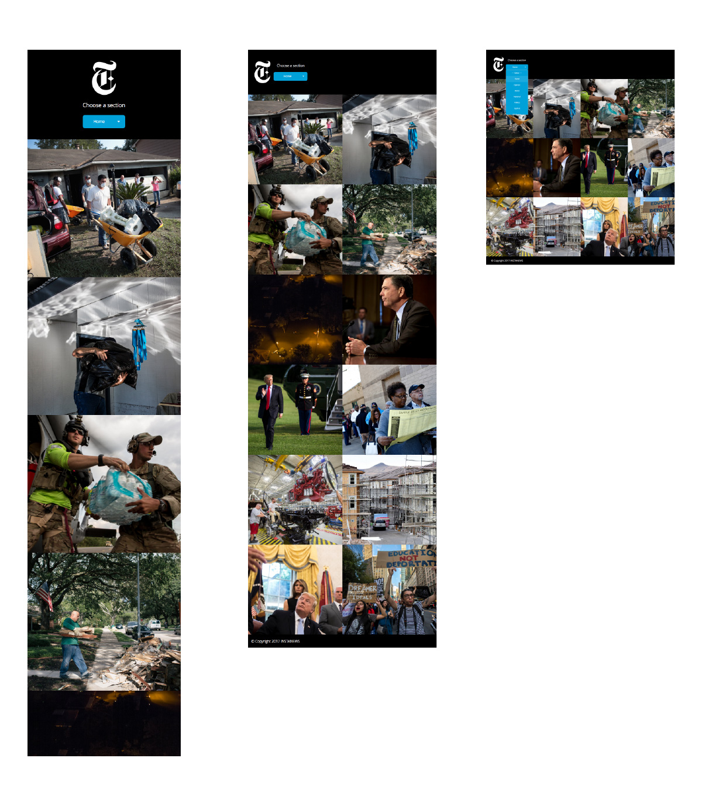

# Project 2 - Instanews App
Instanews App is an app that displays the different top news stories from the New York Times. Users can filter through different sections of the New York Times and the app will display 12 top stories from that section of the New York Times. 

  - Select section from the select dropdown
  - Hover over the images to see abstract
  - Click on desirable article
  - App will redirect user to the story in New York Times website

### Tech & Programming Language
Instanews App uses the following:

* HTML
* CSS
* SASS/SCSS
* Javascript
* jQuery
* Gulp

### Screenshot
These are the screenshot of what the app would look like in the different screen sizes. Starting from mobile first, tablet followed by desktop view.
  - Mobile (Below 600px)
  - Tablet (Between 600px and 1000px)
  - Desktop (above 1000px)

  

  #### On Hover
  When user hovers over the images, a excerpt will be shown and users can click anywhere on the picture to go to the New York Times website to read the article in more detail.

  

### Plugins
Instanews App uses these following plugins:

| Plugin | Usage |
| ------ | ------ |
| Selectric | Custom select dropdown |